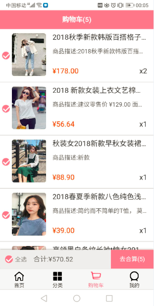
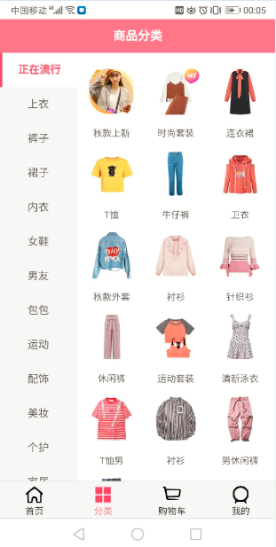
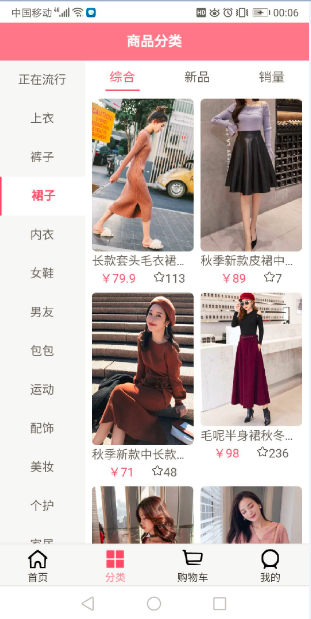

### 项目介绍

本项目是一个基于vue实现的**移动端**仿蘑菇街商城项目，来源于B站上coderwhy老师的课程（ https://www.bilibili.com/video/BV15741177Eh?from=search&seid=14740493413301938729 ），算是我第一个完整的前端项目，非常感谢老师带我感受到了vue的魅力。

项目完成了”首页“，”详情页“、”分类“、”购物车“和”我的“五个页面，其中”分类“和”我的“两个页面视频中没有讲，我在做的时候也踩到了一些坑，后边会做一些说明。

首页基本上按照老师的讲解没做什么变化，但是做完以后感觉better-scroll的坑太多，所以后边的页面全部采用原生的滚动，用手机实际测试以后发现并没有老师说的那样：原生滚动在移动设备上会很卡。反倒是better-scroll有点卡顿，也可能是因为现在高版本的移动浏览器对原生滚动的支持变好了。

### 项目演示

项目使用Nginx部署在百度云服务器上

pc端：[请戳这里]( http://106.13.23.235:3000/ )（建议使用chrome手机模式预览）

移动端：

<div></div>

### 技术栈

vue + vuex + vue-router + webpack + ES6 + axios

### 项目运行

项目使用vue-cli4

```shell
npm run serve    #运行项目
npm run build    #打包项目
```

### 接口说明

接口需要找老师购买，所以项目中用的接口不是真正的接口，直接下载运行项目是没有数据显示的，视频介绍里边有购买接口的方法，只需要9块钱，一杯奶茶而已，算是对老师的支持吧。

### 首页

<div>
    
    
</div>

首页中的“本周流行”是超链接到蘑菇街的网站，下边的数据是从接口获取的，分为“流行”、“新款”和“精选”，下拉能加载更多，点击能进入到商品的详情页，滚动相关的功能都是基于better-scroll。

### 详情页

<div>
    
    
    <br></br>
    
    
</div>

详情页分为“商品”、“参数”、“评论”、“推荐”，点击相应的标题滚动到对应的页面，滚动到对应的页面时标题也会随之改变，实现思路和老师的思路一样，只是换成了原生滚动的方法。底部功能栏中只做了购物车功能。

### 购物车

<div>
    
</div>

使用vuex来管理购物车中的商品，在详情页中可以将商品加入购物车，将商品中的信息放入vuex中，然后在购物车界面可以拿到这些数据，实现选择和计算总价等功能。

### 分类

<div>
    
    
</div>

分类页面中通过设置div的overflow为scroll来实现左边的菜单栏和右边的商品栏能够分别滚动。

可以通过下边代码隐藏滚动条

```css
  .menu-list::-webkit-scrollbar {
    display: none;
  }
```

在获取数据的时候发现老师的代码中有一句

```js
this.categoryData = {...this.categoryData}
```

自己写的时候感觉这句代码好像没啥用，所以就没写，结果数据显示不出来，调试后才发现原来是因为在保存获取的数据时候用的是对象，在给组件传数据的时候用的是computed计算属性，但是对象中的值改变不会触发计算属性，所以就拿不到获取后的数据，所以要加上这一句来触发计算属性。

### 我的

<div>
    
</div>

在写“我的”时候又踩了一个坑，没有看懂老师的svg图标哪来的，并且用老师的代码也出不来图标，所以上边的几个图标我是从阿里的图标库自己找了几个图标，后来发现老师是封装了一个svg图标库，以组件形式放在了App.vue中，通过svg的use属性直接引用。
